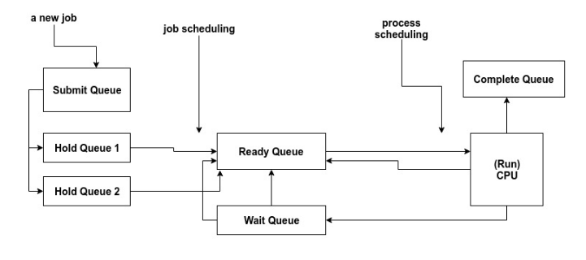

# CPU and Job Scheduler Simulator

In this project, I designed and implement a program that simulates the job scheduling and CPU scheduling of an operating system.
In addition to the scheduling algorithms, I implemented a deadlock avoidance method by implementing the Banker’s Algorithm.

